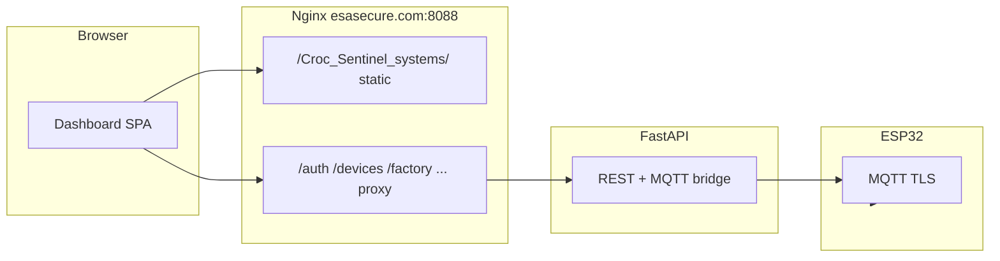

# Croc Sentinel 架构整理与生产化改造计划

## 现状评估（是否「混乱」）

**结论：逻辑主干是清晰的，但「部署形态、出厂流程、固件侧 WiFi 来源」叠在一起会显得乱。**

- **数据流（合理）**：设备经 MQTT 上报 `status` / `heartbeat` / `event` / `ack`；[`croc_sentinel_systems/api/app.py`](croc_sentinel_systems/api/app.py) 的 `on_message` 写入 DB 并驱动在线判定、告警扇出（例如 `alarm.trigger` 走 `_fan_out_alarm_safe`）；Dashboard 通过 REST 读设备列表与概览，并通过 `POST /devices/{id}/commands` 调用 [`publish_command`](croc_sentinel_systems/api/app.py) 下发 MQTT 指令。固件侧 [`Croc Sentinel.ino`](Croc%20Sentinel.ino) 的 `ensureWiFi` / `ensureMqtt` 已有指数退避重连。
- **易混点**：
  1. **WiFi 凭证多源**：`WiFiMulti` 同时注册 **NVS**（`wifi_sta_ssid` / `wifi_sta_pass`）与 **编译期** `WIFI_SSID`…`WIFI_SSID_4`（见 [`g_wifiMultiRegisterAps`](Croc%20Sentinel.ino)）。Dashboard 改的 NVS 与 `config.h` 里硬编码 AP 会一起参与选网，现场会困惑「到底连的谁」。
  2. **`wifi_scan`**：固件异步扫描 + Dashboard「Scan networks」与 `wifi_config` 并存；扫描可能扰动链路（代码里已注明 STA 模式风险），与你「避免一直断开重连」目标冲突。
  3. **出厂工具与固件**：[`tools/factory_pack/factory_ui.py`](tools/factory_pack/factory_ui.py) 已支持 `POST /factory/devices` 与 `.env` 的 `FACTORY_UI_API_BASE`；要达成「只烧录、不在固件里改设置」，需要 **生产镜像策略**（见下文）而不是再堆一层协议。
  4. **`app.py` 体量**：单文件 6000+ 行，**功能上不混乱**，长期维护可择机按域拆模块（非本次必须，文末说明）。

你已确认：**UI 在 `https://esasecure.com:8088/Croc_Sentinel_systems/`，API 在根路径**。此时 [`apiBase()`](croc_sentinel_systems/api/dashboard/assets/app.js) 使用 `location.origin` **是正确的**（请求落在 `/auth/...`、`/devices/...`）。需在 **Nginx** 显式分流：静态只挂子路径，其余反代到 FastAPI。

---

## 1. 反向代理与域名（`esasecure.com:8088`）

- **Nginx（或等价网关）**：
  - `location /Croc_Sentinel_systems/` → 静态目录（`index.html` + `assets/`，注意 `try_files` 与 SPA 回退）。
  - `location ~ ^/(auth|devices|commands|dashboard|admin|provision|health|logs|audit|factory|... )` → 反代到 Uvicorn（端口按你 docker 映射）。
- **服务端**：继续用环境变量 [`DASHBOARD_PATH`](croc_sentinel_systems/api/app.py) 控制 FastAPI 内静态挂载路径（开发/直连场景）；生产若由 Nginx 单独出静态，可保留 API 容器内挂载作备用。
- **文档**：在 [`croc_sentinel_systems/README.md`](croc_sentinel_systems/README.md) 或现有部署文档中增加一节 **「子路径 UI + 根路径 API」** 的示例 `server` 块，避免后人改错 `apiBase`。

---

## 2. 固件：ESP 稳定连 Server + Dashboard 实时

- **MQTT 端点**：[`config.h`](config.h) 中 `MQTT_HOST` / `MQTT_PORT` / TLS CA 必须与线上 Broker 一致；若 Broker 使用域名，**证书 SAN 需包含该域名**（或与现有「双 CA 槽位」轮换策略一致）。
- **在线判定**：Dashboard 依赖服务端对 `heartbeat`/`status`/`ack`/`event` 的时间戳与 [`_effective_online_for_presence`](croc_sentinel_systems/api/app.py) 逻辑；固件已在 MQTT 重连后 `publishStatus` + `publishHeartbeatEvent("mqtt_connected")`，有利于快速变绿。
- **触发闭环（已具备，整理即可）**：
  - **Dashboard → 设备**：`siren_on` / `siren_off` 等经 `/devices/{id}/commands` → `publish_command` → 设备 `topicCmd`（需 `can_send_command` / `can_alert` 等策略不变）。
  - **GPIO → Server → 按设置扇出**：本地触发发布 `alarm.trigger` 事件，服务端 `_fan_out_alarm_safe` 按租户规则下发（保持现有行为，可在文档中用一页流程图说明）。

---

## 3. 去掉 WiFi 搜索 + Dashboard 只保留「改 SSID/密码」

| 层级 | 改动 |
|------|------|
| 固件 [`Croc Sentinel.ino`](Croc%20Sentinel.ino) | 删除 `wifi_scan` 命令分支、`pollWifiScanCompletion`、`publishWifiScanAckJson` 及 `publishCommandTable` 中的 `wifi_scan`；删除 `loop()` 里对 `pollWifiScanCompletion` 的调用。保留 **`wifi_config` / `wifi_clear`**（已写入 NVS 并 `requestRestartWithAck`）。 |
| Dashboard [`app.js`](croc_sentinel_systems/api/dashboard/assets/app.js) | 移除设备详情里的「Scan networks」按钮与 `waitForCmdAck("wifi_scan")` 相关 UI；保留 SSID/密码表单与「Save & reboot」「Clear saved Wi‑Fi」；文案改为「手动填写 2.4G SSID/密码」。 |

---

## 4. WiFi：减少「断线狂重连」的生产策略

- **固件**：
  - **生产编译建议**：`WIFI_SSID`…`WIFI_SSID_4` 置空（或仅保留厂内测试用 profile），**现场网络只走 NVS**（由 Dashboard `wifi_config` 或出厂写号流程预置），避免与 `config.h` 多 AP 抢优先级。
  - 在 `wifi_config` 成功后（已有 reboot）：可选小优化 —— reboot 前 `mqttClient.disconnect()` 干净下线，减少 Broker 侧遗留意向消息抖动（若当前 `requestRestartWithAck` 未做，可补一行）。
  - 保持 `ensureWiFi` 中 **slice join** 与 **全量 `reconnect()`** 的分工；避免在「已连接但 RSSI 波动」时频繁 `reconnect()`（若后续日志显示仍抖动，再加「连接态下仅 slice、掉线才 reconnect」的门槛条件）。
- **服务端**：无需为 WiFi 单独加 API；继续走现有 command 通道即可。

---

## 5. 内存与「爆内存」防护（固件为主）

- **已有**：MQTT 回调使用栈上 `body[]`、固定 `StaticJsonDocument`、离线队列结构等。
- **建议增量**：
  - 审计 **离线队列**最大条数/单条 payload 上限（[`OfflineMessage`](Croc%20Sentinel.ino)），队列满时明确丢最旧或拒绝并记 `ack`/日志，避免 RAM 线性增长。
  - 热路径减少 `String` 拼接（如 `[net] ip=`），与现有注释「避免碎片化」一致，优先 `snprintf` 到小缓冲。
  - 确认 `MQTT_JSON_DOC_BYTES`、`MQTT_RX_BUFFER_BYTES` 与最大命令体匹配，避免大 JSON 解析失败静默丢包。

---

## 6. 出厂序列号 / 二维码 App 全自动对接 API

- [`factory_ui.py`](tools/factory_pack/factory_ui.py) + [`factory_core.py`](tools/factory_pack/factory_core.py) 已实现登记逻辑。
- **改造**：
  - 默认 `FACTORY_UI_API_BASE` / 界面占位改为生产地址：`https://esasecure.com:8088`（**不含** `/Croc_Sentinel_systems`，因 Factory API 在根路径 `/factory/...`）。
  - `.env.example` 增加 `FACTORY_UI_API_BASE` 与 `ENFORCE_FACTORY_REGISTRATION=1` 的说明，与 [`/factory/devices`](croc_sentinel_systems/api/app.py) 鉴权（`X-Factory-Token`）对齐。
- **「烧录固件不改固件设置」**：生产流程定为 **同一套 MQTT 根密钥 + Bootstrap 凭据** 编译进固件；**每台设备的 identity** 来自二维码/NVS（`qr_code`、claim 后 `mqtt_u`/`mqtt_p`/`cmd_key`）— 这与现有 `saveProvisioningFromClaim` / NVS 设计一致。若仍需「完全无 NVS 预置 WiFi」，则依赖首次 **以太网** 或 **AP 配网**（当前代码无 Captive Portal，需另开需求）。

---

## 7. 登录 / 注册 UI 焕新

- 改动集中在 [`croc_sentinel_systems/api/dashboard/assets/app.css`](croc_sentinel_systems/api/dashboard/assets/app.css) 与 [`app.js`](croc_sentinel_systems/api/dashboard/assets/app.js) 内 `registerRoute("login" | "register" | ...)` 的模板字符串。
- **方向**：分栏布局（品牌区 + 表单卡片）、柔和渐变/玻璃拟态（适度）、输入聚焦动效、步骤注册进度条、微交互（按钮 loading、错误抖动）、移动端优先的间距与触控区域；保持现有 API 调用与 OTP 流程不变。

---

## 8. 安全与仓库卫生（生产必做）

- [`config.h`](config.h) 当前含 **MQTT 密码、OTA token、CMD_AUTH_KEY 等明文** — 生产仓库应改为 **`config.h.example` + 本地不提交 `config.h`**，或构建时注入；并在文档中强调 **与 `.env` 双端一致**。  
- **MQTT 凭据**：固件 `PROD_ENFORCE` 会校验占位符；服务器侧 `CMD_AUTH_KEY` / `BOOTSTRAP_BIND_KEY` 必须与设备一致（README 已说明）。

---

## 9. 可选重构（不阻塞上线）

- 将 [`app.py`](croc_sentinel_systems/api/app.py) 按 **MQTT 回调 / 设备命令 / 认证 / Factory** 拆成子模块，降低单文件认知负担。
- Dashboard `app.js` 按路由拆文件（需简单打包策略或保持单文件但抽 `authViews.js` 由构建拼接）。

---

## 实施顺序建议

1. Nginx 示例 + 环境变量文档（验证 UI 子路径 + API 根路径联调）。  
2. 固件删 `wifi_scan` + Dashboard 去扫描 UI；生产 `config.h` 清空多余 `WIFI_SSID_*`。  
3. 固件内存队列与日志 `String` 小改（按 profiling 结果取舍）。  
4. 出厂工具默认 API base + `.env.example`。  
5. 登录注册 CSS/HTML 结构重做并回归 OTP/审批流程。
