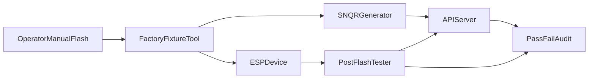

# Security-First Factory Automation Plan

## Product Goal / 目标
- Keep **manual flashing** (operator action) but automate everything else end-to-end.
- Prevent counterfeit/unauthorized devices from joining your system.
- Auto-push generated SN/QR and manufacturing metadata to server.
- Keep a post-flash test tool for pass/fail gating.
- Replace manual Wi-Fi code edits with first-boot captive provisioning and persistent credentials.

## Final Operating Model / 最终运行模型
- Operator only does: connect board -> click flash/start fixture.
- System auto does: SN/QR assignment, anti-clone binding, server registration, device attestation, connectivity test, result logging.
- Device first boot opens ESP captive portal if no Wi-Fi credentials; credentials are saved in NVS and reused.

## Core Security Design / 核心安全设计
- **Immutable identity**: `device_id = serial (SN-...)` in production.
- **Factory trust chain**:
  - SN/QR generated with signed payload (existing factory HMAC model).
  - Server accepts bootstrap/claim only if serial exists in `factory_devices` and status is valid.
- **Anti-clone binding**:
  - Bind `serial <-> mac_nocolon` at first successful registration.
  - Reject later mismatches unless explicit superadmin override endpoint is used.
- **Claim challenge enforcement**:
  - Keep challenge/nonce verification enabled for provision path.
- **Command security**:
  - Per-device command key required, no raw unauthenticated command execution.

## End-to-End Flow / 端到端流程

## Phase A: Factory Pipeline Hardening / 工厂流程加固
- Build/standardize one orchestrator entry (`factory_pipeline`) around existing tools:
  - [E:/Croc Sentinel/tools/factory_pack/generate_serial_qr.py](E:/Croc Sentinel/tools/factory_pack/generate_serial_qr.py)
  - [E:/Croc Sentinel/tools/factory_pack/factory_core.py](E:/Croc Sentinel/tools/factory_pack/factory_core.py)
  - [E:/Croc Sentinel/tools/factory_pack/factory_ui.py](E:/Croc Sentinel/tools/factory_pack/factory_ui.py)
- Default to auto-push after generation; no optional/manual push in production profile.
- Add local durable queue (`pending_push.jsonl`) with retry/backoff and idempotency keys.
- Persist per-unit run state (`reserved -> flashed -> verified -> uploaded -> tested -> passed`).

## Phase B: Anti-Counterfeit Admission Control / 防冒用接入控制
- Server-side strict checks in [E:/Croc Sentinel/croc_sentinel_systems/api/app.py](E:/Croc Sentinel/croc_sentinel_systems/api/app.py):
  - Enforce factory registration for bootstrap (`ENFORCE_FACTORY_REGISTRATION=1`).
  - Enforce challenge verification for claim path.
  - Add/strengthen serial-MAC binding policy:
    - first bind allowed
    - mismatch => quarantine/reject with audit event.
- Add superadmin-only override endpoint for controlled rebind (hardware replacement/RMA).
- Add anomaly alarms for repeated failed joins from same serial/mac/challenge.

## Phase C: Post-Flash Automated Test Gate / 刷后自动测试闸门
- Keep test tool and make it mandatory before pass label.
- Test script checklist (automated):
  - device boots and announces expected serial
  - Wi-Fi connect success (or captive portal fallback status)
  - MQTT auth/connect success
  - heartbeat and command loop validation (`ping`/`self-test`)
- Only `PASS` units are marked deployable in server manufacturing status.

## Phase D: Wi-Fi Provisioning UX (No Firmware Rebuild) / Wi-Fi 配网体验
- Firmware behavior:
  - If no valid Wi-Fi credentials in NVS: start SoftAP + captive portal page.
  - User enters SSID/password once; device stores encrypted/obfuscated in NVS and reboots/connects.
  - If connection fails repeatedly, auto fallback to provisioning portal.
- Dashboard behavior:
  - Keep `wifi_config` / `wifi_clear` command path for remote updates.
- Security controls:
  - Provisioning portal active only in safe windows (first boot or explicit provisioning mode).
  - Optional one-time setup PIN shown on serial console/label to prevent nearby hijack.

## Data Model Additions / 数据模型补充
- `factory_devices` add fields: `firmware_version`, `firmware_sha256`, `station_id`, `batch_id`, `test_status`, `bound_mac`, `bound_at`.
- `manufacturing_events` table for immutable step audit trail.
- Optional `device_rebind_requests` for superadmin approval flow.

## Operational Policies / 运营策略
- Production profile defaults:
  - strict registration ON
  - strict challenge ON
  - legacy unowned OFF
- Any unit not in factory table or test-failed cannot be claimed.
- Full traceability export per batch for legal/after-sales use.

## Rollout Plan / 上线步骤
- Stage 1: implement pipeline + queue + idempotent push.
- Stage 2: enforce serial-MAC binding and quarantine policies.
- Stage 3: enforce mandatory post-flash PASS gate.
- Stage 4: enable captive portal provisioning and remove Wi-Fi-from-code workflow.

## Acceptance Criteria / 验收标准
- 100% shipped units have complete factory + test audit chain.
- 0 successful claims for unregistered/counterfeit devices.
- 0 manual SN/device-name edits in production operation.
- Wi-Fi setup success on first attempt >= 95% with captive provisioning.
- Reflash/retry path remains recoverable without duplicate identity records.